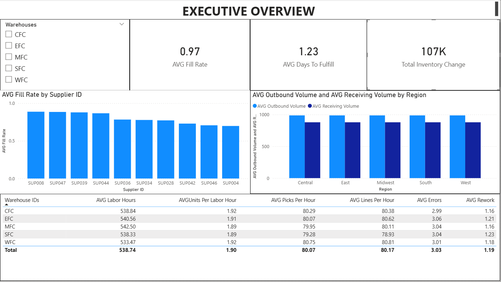
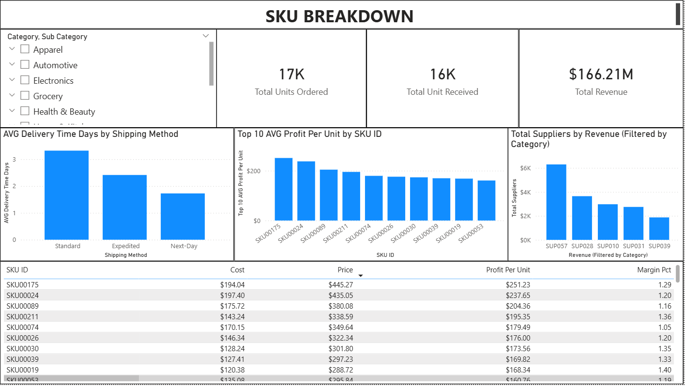

# 📦 Supply Chain Analytics Project

## 🔍 Project Overview

This project analyzes end‑to‑end supply chain performance using **SQL, Python, and Power BI**. The goal is to evaluate how efficiently orders are fulfilled, how warehouses perform operationally, how suppliers deliver against expectations, and which SKUs drive profitability.

Rather than focusing on raw data extraction alone, this project emphasizes **business‑ready metrics**, **data validation**, and **executive‑level insights** suitable for operations, supply chain, or analytics stakeholders.

---

## 🧠 Business Questions Answered

The analysis answers the following core supply‑chain questions:

* 📦 What is the **average supplier fill rate** and **lead time variance**?
* ⏱️ What is the **average days‑to‑fulfill** across customer orders?
* 🔄 What is the **net inventory change** across inventory movements?
* 🏭 How productive are warehouses (units per labor hour, error rate, rework)?
* 💰 Which SKUs are the **most profitable** (profit per unit, margin %)?
* 🔗 Do table relationships behave as expected after modeling?

These questions are validated in SQL before being visualized in Power BI.

---

## 🗂️ Project Structure

```
HGFN_DATASETS/
│
├── data/
     ├── processed/
│       ├── HGFN.db
│       ├── inventory_clean.csv
│       ├── orders_clean.csv
│       ├── sku_clean.csv
│       ├── supplier_clean.csv
│       └── warehouse_clean.csv
│   └── raw/
│      ├── HGFN_INVENTORY_MOVEMENT.csv
│      ├── HGFN_ORDERS.csv
│      ├── HGFN_SKU_MASTER.csv
│      ├── HGFN_SUPPLIER_PERFORMANCE.csv
│      └── HGFN_WAREHOUSE_DAILY.csv
│   
│   
│
├── notebooks/
│   ├── 01_data_exploration.ipynb
│   ├── 02_sql_analysis.ipynb
│   └── 03_advanced_sql_queries.ipynb
│
├── powerbi/
│   └── Supply_Chain_project.pbix
│
├── visuals/
|   ├── Sku_Breakdown.png
|   └── Supply_Chain_Overview.png
└── README.md
```

---

## 🧪 Notebook Breakdown

### 📘 01_data_exploration.ipynb

* Loads raw CSV files
* Performs initial data inspection
* Checks for missing values, data types, and schema consistency
* Confirms readiness for transformation

---

### 📗 02_sql_analysis.ipynb

**Purpose:**
Validate cleaned SQL views and confirm KPIs prior to visualization.

**What this notebook includes:**

* Creation and validation of cleaned views:

  * `orders_clean`
  * `inventory_clean`
  * `warehouse_clean`
  * `supplier_clean`
  * `sku_clean`
* KPI sanity checks (averages, totals, joins)
* Relationship validation between fact and dimension‑like tables

This notebook ensures Power BI visuals are based on **trusted calculations**, not assumptions.

---

### 📙 03_advanced_sql_queries.ipynb

* More complex analytical queries
* Aggregations across multiple business domains
* Deeper exploration of performance drivers

This notebook demonstrates advanced SQL thinking and multi‑table reasoning.

---

## 📊 Power BI Dashboard

The Power BI report includes **two primary pages**:

### 🧭 Executive Overview

High-level operational health snapshot:

* Average fill rate
* Average days to fulfill
* Inventory movement summary
* Warehouse productivity metrics

Designed for leadership and operations managers.

### 🧩 SKU Breakdown

Product-level and revenue insights:

* Total units ordered and received
* Total revenue
* Profit per unit by SKU
* Revenue by supplier
* Delivery time by shipping method

Supports tactical decisions around pricing, suppliers, and fulfillment strategy.

---

## 🖼️ Dashboard Visuals

### Executive Overview

* **KPIs:** Avg Fill Rate, Avg Days to Fulfill, Total Inventory Change
* **Charts:** Fill Rate by Supplier, Outbound vs Receiving by Region
* **Table:** Warehouse productivity (Units/Labor Hr, Picks/Hr, Lines/Hr, Errors, Rework)



### SKU Breakdown

* **KPIs:** Total Units Ordered, Total Units Received, Total Revenue
* **Charts:** Avg Delivery Time by Shipping Method, Avg Profit per Unit by SKU, Total Revenue by Supplier
* **Detail Table:** SKU attributes (Cost, Price, Profit per Unit, Margin %)



---

## 🛠️ Tools & Technologies

* **Python** (Pandas, SQLite)
* **SQL** (views, joins, aggregations)
* **Power BI** (data modeling, DAX measures, dashboards)
* **Jupyter Notebooks** (analysis + documentation)

---

## 🎯 Key Takeaways

* Demonstrates end‑to‑end analytics workflow: raw data → SQL validation → BI visualization
* Emphasizes correctness and explainability over over‑engineering
* Designed to mirror real‑world supply chain and operations analytics work

---

## 🚀 Next Steps (Optional Enhancements)

* Add time‑series trend analysis
* Expand supplier‑to‑SKU cost modeling
* Introduce forecast or capacity planning metrics

---

**Author:** Jaylund Harris
**Focus Areas:** Supply Chain Analytics • SQL • Power BI • Operations Insight
